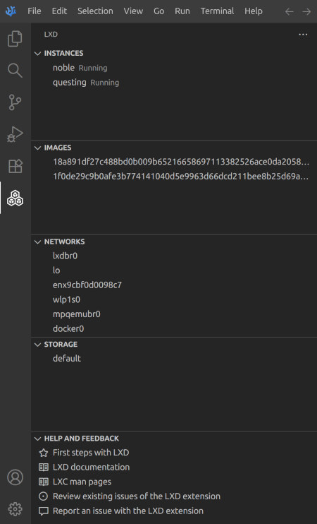

# LXD Extension for Visual Studio Code   

This Extension for Visual Studio Code makes it easy to create, manage, and inspect [LXD](https://canonical.com/lxd) containers.

## Features

### LXD Explorer

This extension contributes an LXD Explorer view to VS Code. The LXD Explorer lets you examine and manage LXD-related assets: instances, images.

## License

vscode-lxd    
Copyright (C) 2025 Dominik Viererbe \<hello@dviererbe.de\>

This program is free software: you can redistribute it and/or modify
it under the terms of the GNU Affero General Public License as
published by the Free Software Foundation, either version 3 of the
License, or (at your option) any later version.

This program is distributed in the hope that it will be useful,
but WITHOUT ANY WARRANTY; without even the implied warranty of
MERCHANTABILITY or FITNESS FOR A PARTICULAR PURPOSE.  See the
GNU Affero General Public License for more details.

You should have received a copy of the GNU Affero General Public License
along with this program.  If not, see <https://www.gnu.org/licenses/>.
